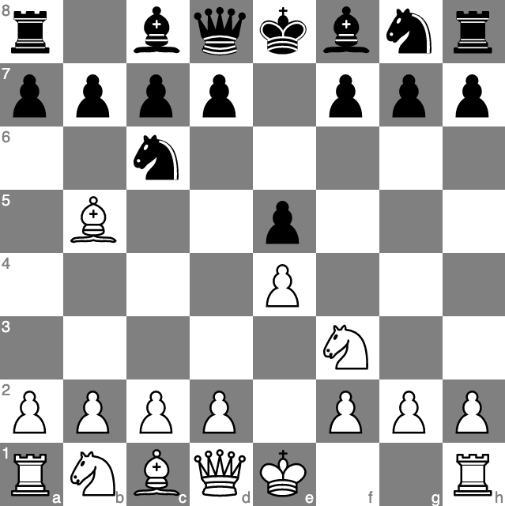

# Chessboard SVG

This is a library to draw chesbboards and chess schemes in SVG. Differently from other libraries (such as chessboard.js), this library has the following design goals:

- Fully modular and TypeScript compatible (it will not inject anhything in `document` or `window`: it will just return a `SVGElement` that you have to append into a SVG canvas).
- Minimal. It's purpose is to draw chessboard positions. There is no interactivity.
- Zero dependencies. This library has zero dependencies. It just uses the low level browser's SVG API to provide a completely self-contained experience.

## Example

### TypeScript

```typescript
/**
 * Example consumer function.
 */
function drawChessboard(): SVGElement {
  const xmlns = "http://www.w3.org/2000/svg";
  var boxWidth = 500;
  var boxHeight = 500;
  var block = document.createElementNS(xmlns, "svg");
  block.setAttributeNS(null, "viewBox", "0 0 " + boxWidth + " " + boxHeight);
  block.setAttributeNS(null, "width", String(boxWidth));
  block.setAttributeNS(null, "height", String(boxHeight));

  const ruyLopez = "r1bqkbnr/pppp1ppp/2n5/1B2p3/4P3/5N2/PPPP1PPP/RNBQK2R";
  const svgChessboard = SVGChessboard.fromFEN(ruyLopez);
  var board = svgChessboard.draw();

  block.appendChild(board);
  block.style.display = "block";

  const svgContainer = document.getElementById("svgContainer");
  if (svgContainer !== null) {
    svgContainer.appendChild(block);
  }
  return block;
}

drawChessboard();
```

### HTML

```html
<!DOCTYPE html>
<html>
  <head>
    <script src="https://requirejs.org/docs/release/2.3.6/comments/require.js"></script>
    <script src="../dist/svgchessboard.js"></script>
  </head>
  <body>
    <div id="svgContainer"></div>
    <script>
      require(["index"]);
    </script>
  </body>
</html>
```

### Result



### Annotations

It is possible to color specific squares using, for instance,

```ts
svgChessboard.highlight("c5", "red");
```

## Development

This library is still a work in progress (mostly to support my Obsidian chess viewer plugin). Any contribution is welcome.
